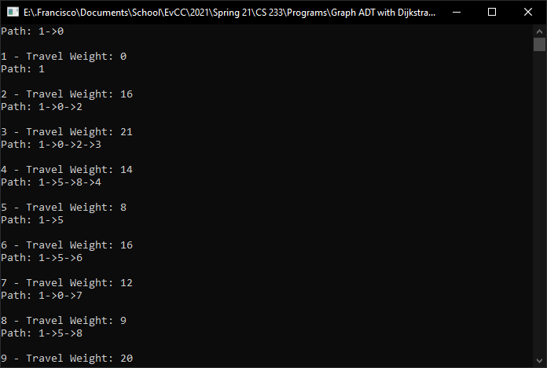

# CS 233 Data Structures & Algorithms
- Implements a graph data structure using an adjacency list 
- Finds all shortest paths from starting node 1 and 14 using Dijkstras algorithm. 

## Output Example 

